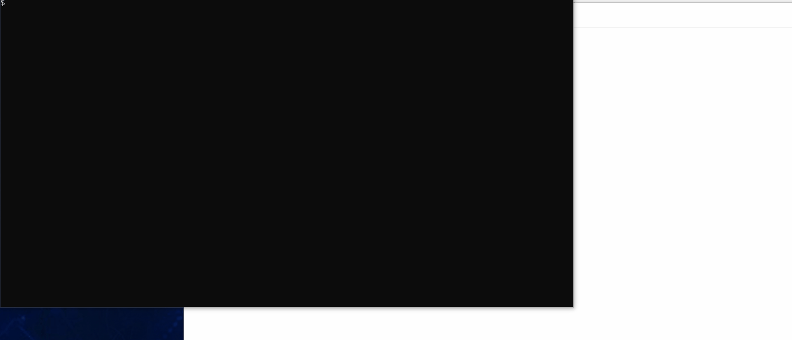
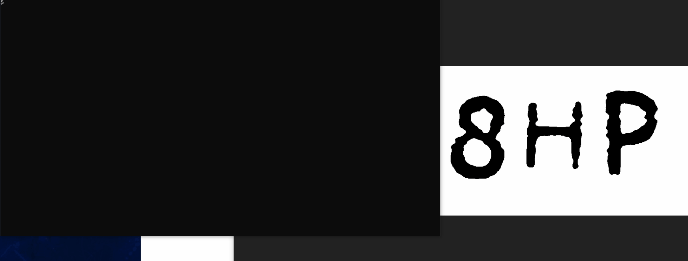

# autotyper

## Requirements

First thing first, you must have [Tesseract](https://github.com/UB-Mannheim/tesseract/wiki) installed.

### Setup and activate virtual environment :
For Unix based systems please execute the following command to create venv and install requirements.
```
make init
source .venv/bin/activate
```
For windows user, 
```
py -m venv env
.\env\Scripts\Activate.ps1
py -m pip install -r requirements.txt
```


## How to use
Just stretch over image, it will type on prescribed point

* Press Up key : For defining particular page
* Press Click : At (0,0) of your image for initialization
* Press Click : At (x,y) of your image for coordinates termination
* Press Down Key : For defining typing part

## Examples
### First
<div align="center">
  
</div>

## Second
<div align="center">
  
</div>