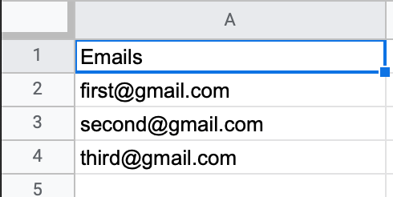

# Bulk Email Sender

### Getting started

- To begin with you will have to download the required module. You can do this by doing: 
    `pip3 install -r requirements` or `pip install -r requirements`

- The script supports .xlsx files. You can add all the emails in excel in this format: 
    
- Note that you will have to keep the excel sheet in the same directory as your python script

- Before executing the program you will have to allow less secure apps in your google account settings. It falls under the security settings

- After executing the program it will ask you for:
    1) Your Email
    2) Your Password
    3) The body of the message
    4) The subject of the message

