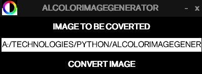
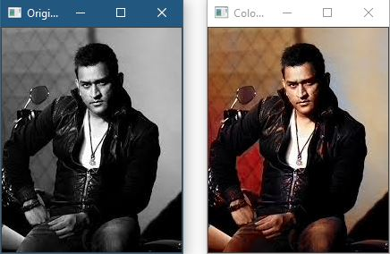
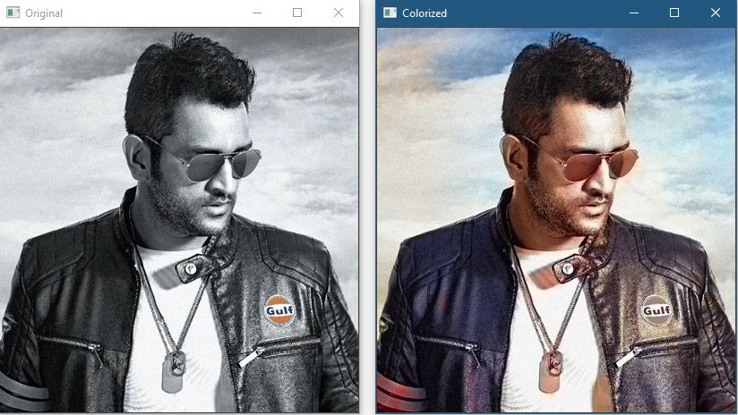

# AlColorImageGenerator

A python script based GUI interface to convert black and white image into colored image.

## Installation

Use the package manager [pip](https://pip.pypa.io/en/stable/) to install packages.

```bash
pip install numpy
pip install opencv_contrib_python
pip install Pillow
```

## Usage








1. Click on the IMAGE TO BE COVERTED button and select the image file.
2. Then click on CONVERT IMAGE button and colored images will be created in ./images/color folder.

## Contributor

<a href="https://github.com/alankarartist/ALCOLORIMAGEGENERATOR/graphs/contributors">
    
</a>
