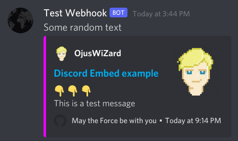

## Discord Embed Message
A Discord webhook is an API interface, this code sends an HTTP request to this webhook with a message payload in a specific JSON form. This payload will be interpreted by discord and shows it in Embedded form as a message in the channel.

**Usage**
1. Goto your discord server settings
2. Goto Integrations tab
3. Click Webhooks
4. Make a new webhook and copy its URL
5. Give that URL as a string in the example_calling() function
6. Run the script using
```bash
python discord_embedded_message/message.py
```

### Screenshot
