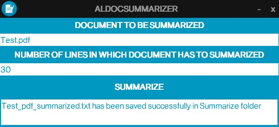
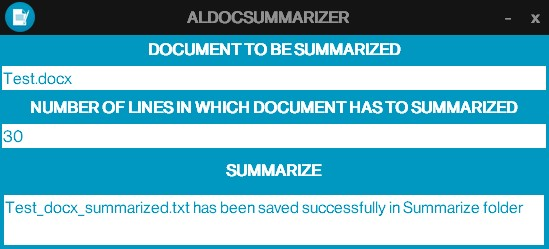

# AlDocSummarizer

A python script based GUI interface to summarize documents (.pdf and .docx files).

## Installation

Use the package manager [pip](https://pip.pypa.io/en/stable/) to install packages.

```bash
pip install PyPDF2
pip install python-docx
pip install Pillow
```

## Usage





1. Provide the input as given in above image.
2. Then, click on SUMMARIZE button.