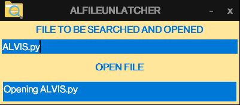

# AlFileUnlatcher

A python script based GUI interface to search and open all files with same name which are present in the system.

## Installation

Use the package manager [pip](https://pip.pypa.io/en/stable/) to install packages.

```bash
pip install Pillow
```

## Usage



1. Provide the input as given in above image.
2. Then, click on OPEN FILE button.

**Note: Be patient whenever you are searching for any file first time. 2nd time when you search the same file it will open it instantly.**
