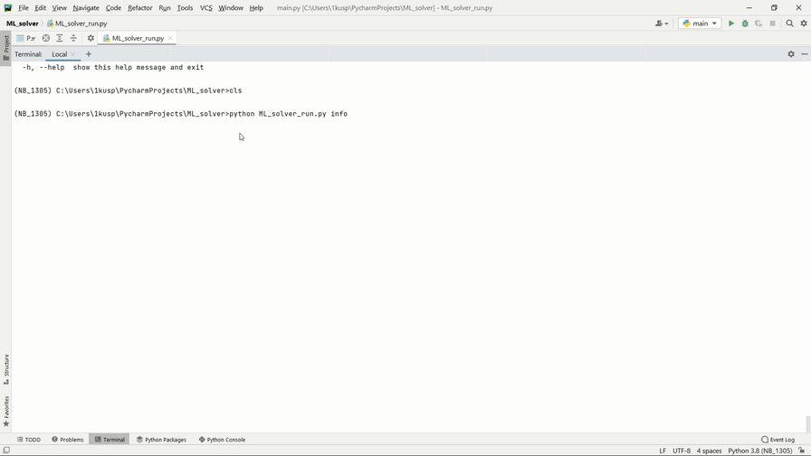
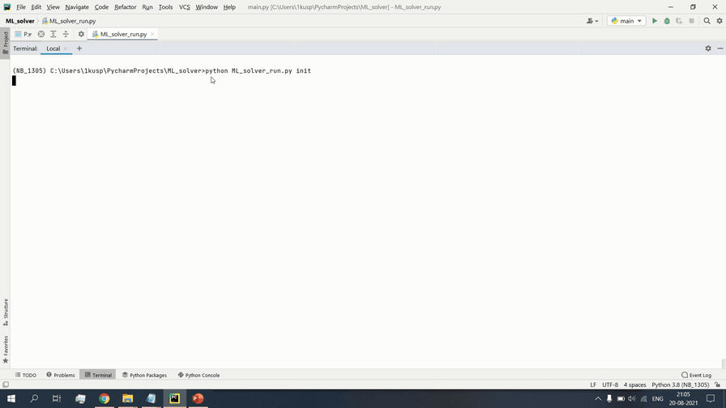
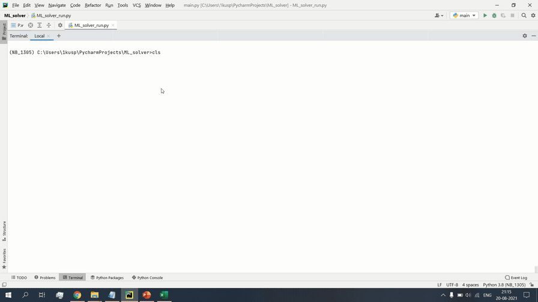
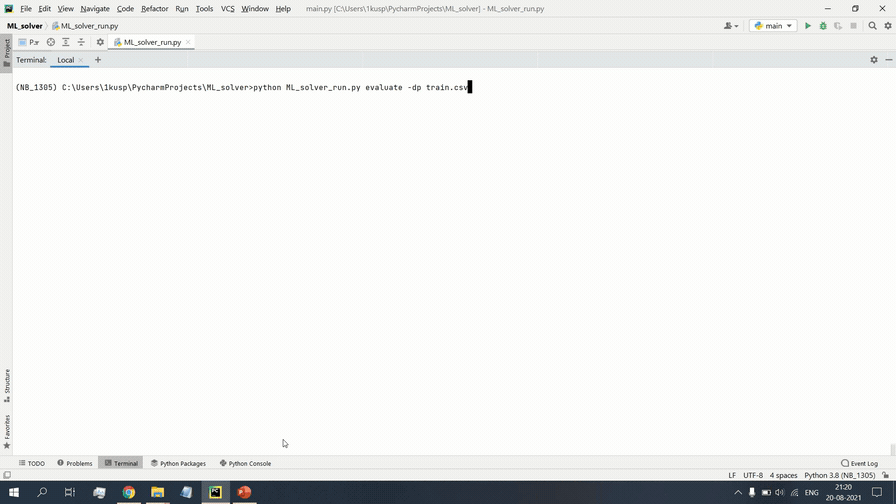
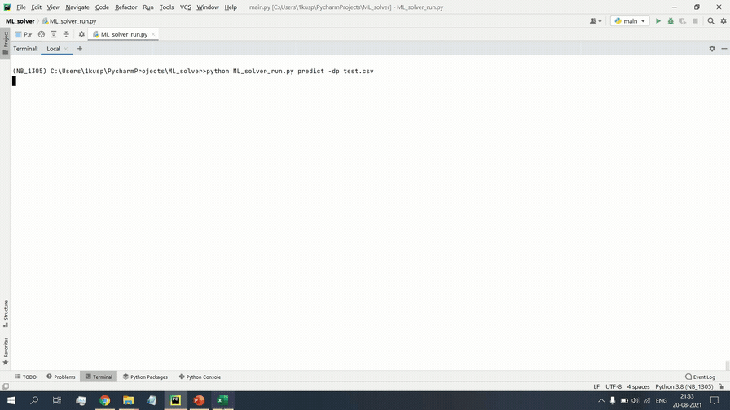
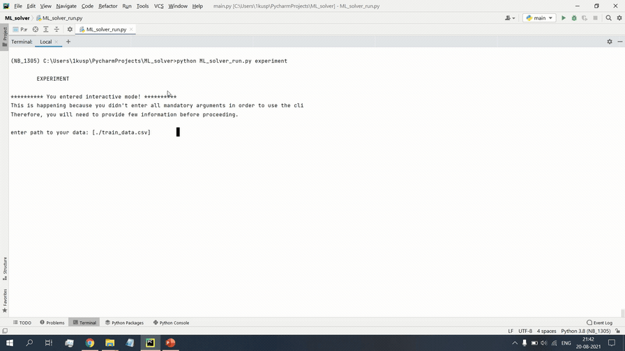

=================================================================
ML_solver: A powerful automated CLI based script for ML models
=================================================================

.. contents:: Table of Contents
    :depth: 3

|
|

Goal
----
ML plays a very important role, but everytime writing a boilerplate code is hectic and moreover we always want to figure out the best model for our data.
Therefore, I decided to create **ML_solver**, which provides a user friendly command line interface to train, predict, evaluate ML models.

Intro
--------
All you need is a **yaml** (or **json**) file, where you need to describe what you are trying to do. That's it!
ML_solver supports all sklearn's machine learning functionality, whether regression, classification or clustering.

 Unlike other ML tools, ML_solver is lightweight in the sense that it has minimal dependencies.
 Precisely, ML_solver uses pandas in the background for data manipulation/preprocessing and sklearn for the machine
 learning part. Hence, it depends only on these two famous packages.

Models
-------

ML_solver's supported models:

.. code-block:: console

        +--------------------+----------------------------+-------------------------+
        |      regression    |        classification      |        clustering       |
        +--------------------+----------------------------+-------------------------+
        |   LinearRegression |         LogisticRegression |                  KMeans |
        |              Lasso |                      Ridge |     AffinityPropagation |
        |          LassoLars |               DecisionTree |                   Birch |
        | BayesianRegression |                  ExtraTree | AgglomerativeClustering |
        |    HuberRegression |               RandomForest |    FeatureAgglomeration |
        |              Ridge |                 ExtraTrees |                  DBSCAN |
        |  PoissonRegression |                        SVM |         MiniBatchKMeans |
        |      ARDRegression |                  LinearSVM |    SpectralBiclustering |
        |  TweedieRegression |                      NuSVM |    SpectralCoclustering |
        | TheilSenRegression |            NearestNeighbor |      SpectralClustering |
        |    GammaRegression |              NeuralNetwork |               MeanShift |
        |   RANSACRegression | PassiveAgressiveClassifier |                  OPTICS |
        |       DecisionTree |                 Perceptron |                    ---- |
        |          ExtraTree |               BernoulliRBM |                    ---- |
        |       RandomForest |           BoltzmannMachine |                    ---- |
        |         ExtraTrees |       CalibratedClassifier |                    ---- |
        |                SVM |                   Adaboost |                    ---- |
        |          LinearSVM |                    Bagging |                    ---- |
        |              NuSVM |           GradientBoosting |                    ---- |
        |    NearestNeighbor |        BernoulliNaiveBayes |                    ---- |
        |      NeuralNetwork |      CategoricalNaiveBayes |                    ---- |
        |         ElasticNet |       ComplementNaiveBayes |                    ---- |
        |       BernoulliRBM |         GaussianNaiveBayes |                    ---- |
        |   BoltzmannMachine |      MultinomialNaiveBayes |                    ---- |
        |           Adaboost |                       ---- |                    ---- |
        |            Bagging |                       ---- |                    ---- |
        |   GradientBoosting |                       ---- |                    ---- |
        +--------------------+----------------------------+-------------------------+

Quick Start
------------

Run :code:`info` to get meta data about the project.

You can run the help command to get instructions:

.. code-block:: console

    $ --help

    # or 

    $ -h
    
- Demo:

---------------------------------------------------------------------------------------------------------

Configuration
##############

First step is to provide a yaml file (you can also use json if you want)

You can do this manually by creating a .yaml file (called ML_solver.yaml by convention but you can name if whatever you want)
and editing it yourself.
However, if you are lazy (and you probably are, like me :D), you can use the init command to get started fast.

.. code-block:: console

    """
    init <args>
    possible optional args are: (notice that these args are optional, so you can also just run init if you want)
    -type: regression, classification or clustering
    -model: model you want to use
    -target: target you want to predict
    
    Example:
    If I want to use neural networks to classify whether someone is sick or not using the some dataset,
    then I would use this command to initialize a yaml file note that you may need to rename outcome column in .csv to sick:
    $ init -type "classification" -model "NeuralNetwork" -target "sick"
    """
    $ init

After running the command, an ML_solver.yaml file will be created for you in the current working directory. You can
check it out and modify it if you want to, otherwise you can also create everything from scratch.

- Demo:

-----------------------------------------------------------------------------------------------------------

.. code-block:: yaml

        # model definition
        model:
            # in the type field, you can write the type of problem you want to solve. Whether regression, classification or clustering
            # Then, provide the algorithm you want to use on the data. Here I'm using the random forest algorithm
            type: classification
            algorithm: RandomForest     # make sure you write the name of the algorithm in pascal case
            arguments:
                n_estimators: 100   # here, I set the number of estimators (or trees) to 100
                max_depth: 30       # set the max_depth of the tree

        # target you want to predict
        # Here, as an example, I'm using the famous indians-diabetes dataset, where I want to predict whether someone have diabetes or not.
        # Depending on your data, you need to provide the target(s) you want to predict here
        target:
            - sick

In the example above, I'm using random forest to classify whether someone have
diabetes or not depending on some features in the dataset
I used the famous indian diabetes in this example `indian-diabetes dataset <https://www.kaggle.com/uciml/pima-indians-diabetes-database>`_)

Notice that I passed :code:`n_estimators` and :code:`max_depth` as additional arguments to the model.
If you don't provide arguments then the default will be used.
You don't have to memorize the arguments for each model. You can always run :code:`models` in your terminal, which will
get you to interactive mode, where you will be prompted to enter the model you want to use and type of the problem
you want to solve. Igel will then show you information about the model and a link that you can follow to see
a list of available arguments and how to use these.

Train a model
##############

- The expected way to use ML_solver is from terminal:

Run this command in terminal to fit/train a model, where you provide the **path to your dataset** and the **path to the yaml file**

.. code-block:: console

    $ fit --data_path 'path_to_your_csv_dataset.csv' --yaml_path 'path_to_your_yaml_file.yaml'

    # or 

    $ fit -dp 'path_to_your_csv_dataset.csv' -yml 'path_to_your_yaml_file.yaml'

    """
    That's it. Your "trained" model can be now found in the model_results folder
    (automatically created for you in your current working directory).
    Furthermore, a description can be found in the description.json file inside the model_results folder.
    """

- Demo:

--------------------------------------------------------------------------------------------------------

Evaluate the model
###################

You can then evaluate the trained/pre-fitted model:

.. code-block:: console

    $ evaluate -dp 'path_to_your_evaluation_dataset.csv'
    """
    This will automatically generate an evaluation.json file in the current directory, where all evaluation results are stored.
    """

- Demo:

------------------------------------------------------------------------------------------------------

Use model for prediction
#########################

Finally, you can use the trained/pre-fitted model to make predictions if you are happy with the evaluation results:

.. code-block:: console

    $ predict -dp 'path_to_your_test_dataset.csv'
    """
    This will generate a predictions.csv file in your current directory, where all predictions are stored in a csv file
    """

- Demo:

----------------------------------------------------------------------------------------------------------

Start an Experiment
####################

You can combine the train, evaluate and predict phases using one single command called experiment:

.. code-block:: console

    $ experiment -DP "path_to_train_data path_to_eval_data path_to_test_data" -yml "path_to_yaml_file"

    """
    This will run fit using train_data, evaluate using eval_data and further generate predictions using the test_data
    """

- Demo:

Interactive Mode
------------------

This mode basically offers you the freedom to write arguments on your way.
You are not restricted to write the arguments directly when using the command.

This means practically that you can use the commands (fit, evaluate, predict, experiment etc.)
without specifying any additional arguments. For example:

..  code-block:: python

    fit

if you just write this and click enter, you will be prompted to provide the additional mandatory arguments.

