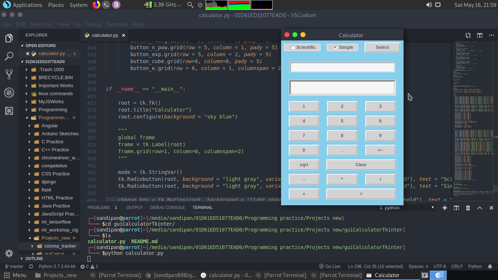
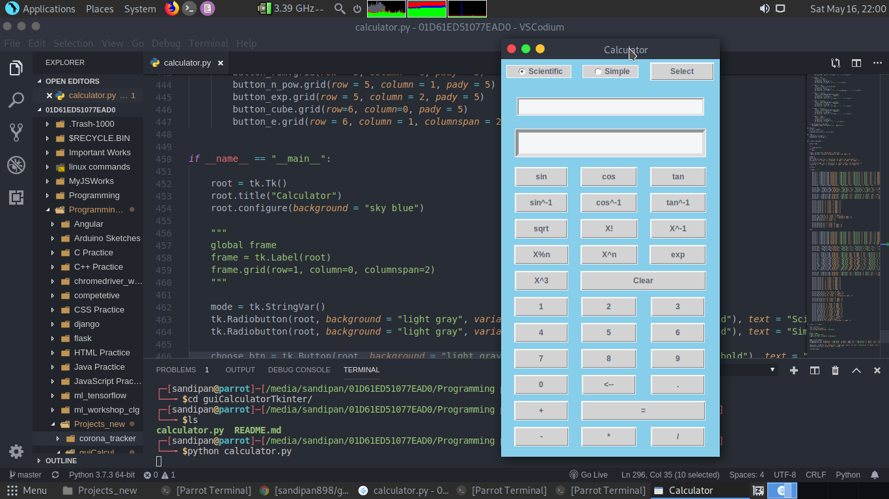

# Calculator Project
A GUI based Multi-mode calculator application using python.
It has two interfaces based on two different modes:  Simple and Scientific, that includes all the simple as and scientific calculation functionalities. User can switch between different modes.

## Tech Stack
### Technologies used: 
* GUI
* complex math operations
* programming

### Programming language used:
* Python

### Modules used:
* tkinter
* math

## How to use:
* Clone the repository
* Run the python file executing the following command:

        python calculator.py

## Simple mode

## Scientific mode

