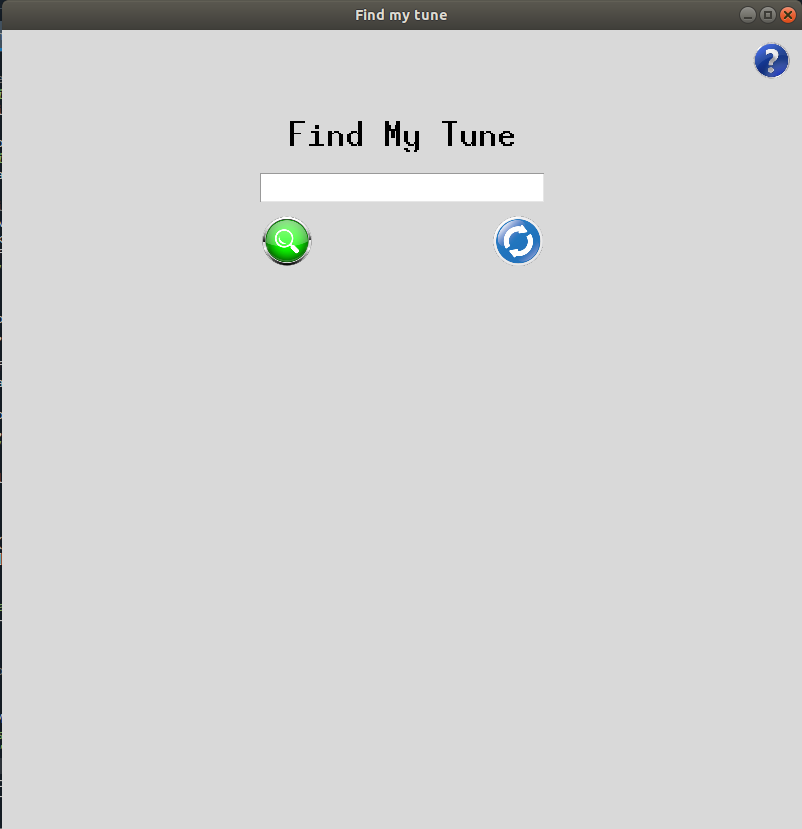
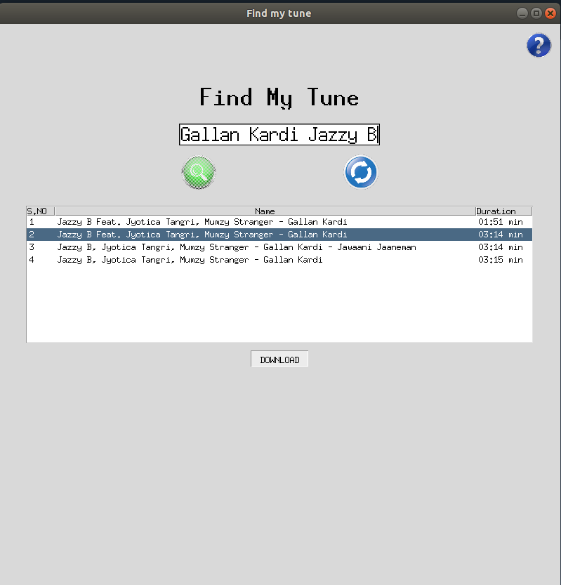
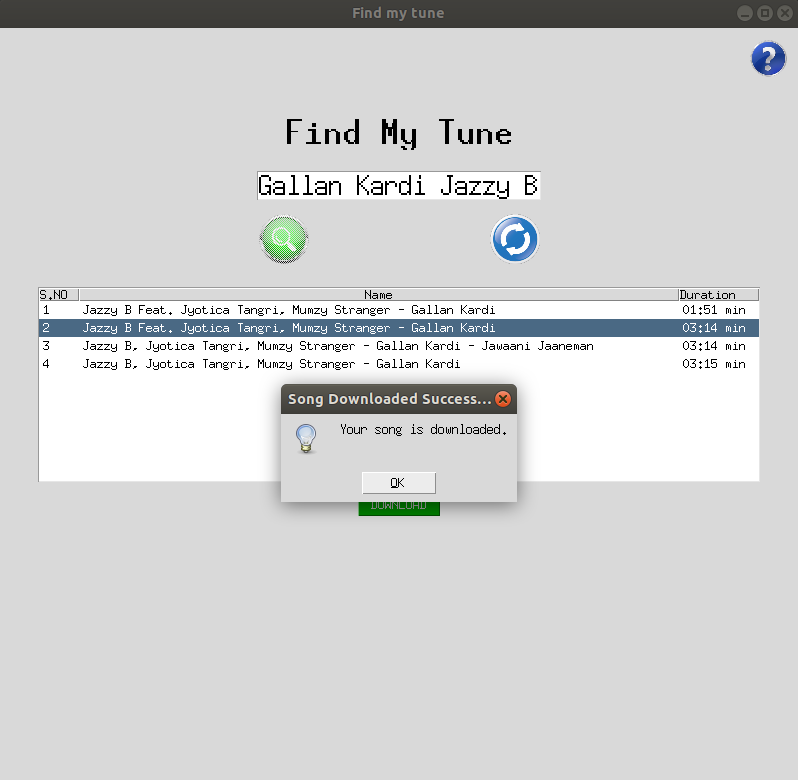
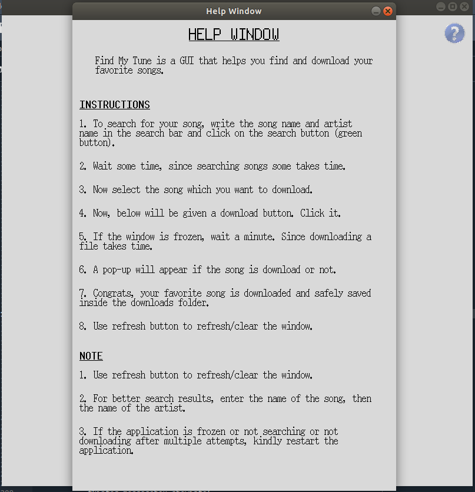

# Find My Tune
Find My Tune is a GUI that helps you find and download your favorite songs.

## Requirements
```
python3
pip3
Tkinter
selenium chrome driver
Selenium
```

## Instruction For Use
1. run requirements.txt

    `pip3 -r install requirements.txt`

2. run the `findMyTune.py` file using the command

    `python3 findMyTune.py`
3. Find my Tune is opened, on the search box enter your song name with artist name<sup>1</sup>.
    
4. Searching the song may take some time, so be patient.
    
5. After the results are shown select any one of the results using the cursor.
    
6. Click on the download button and wait for the results.
7. Voila! your song is download and is saved inside the downloads folder.
    
8. Use the refresh button to clear the results.
9. Steps to use the application and notes are provided in the help window.
    

### AUTHOR
Code written by [Mansi Binjola](https://linktr.ee/MansiBinjola)

### DISCLAIMER
1.  Make sure there is no spelling mistake in your search, as sometimes it doesn't find the song correctly. 
2. There are chances that the song may not be downloaded, so please restart the interface.
3. The song scraper that I have made can only download a file that is less than 5 min. If you want to download a file that is of big size, simply comment line number 69 of `mp3Clan_top_web_scraper.py`.

    `driver.set_page_load_timeout(20)`
