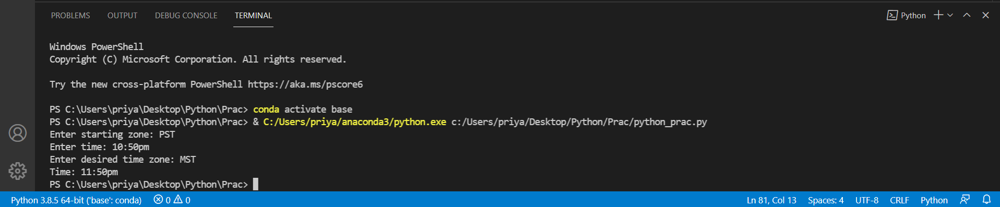

# Time Zone Conversion

This is a python script that converts a time from one time zone to another. The possible time
zones considered are Eastern, Central, Mountain, or Pacific.

---

## Steps to Run

1. Clone/Download this repository
```
git clone clone_path
```
2. Run the program using command
```
time_zone.py
```
---

## Input 
The user enters the time in the usual American way, such as 3:48pm or 11:26am. The first time zone the user enters is that of the original time and the second is the desired time zone.

---

## Output

