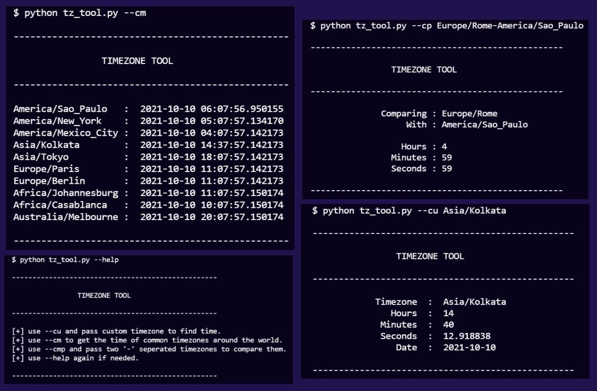

# CLI Tool for Timezones

- This tool lets the user find the time pertaining to various timezones around the globe. 
- It allows users to pass a timezone of their choice or have ten common timezone results printed. 
- On top of that, the user can also pass two different timezones to get the comparisons.
- The script uses the [pytz](http://pytz.sourceforge.net/) library which provides the required functionalities withing the context of python (2.4 or higher).

## Setup instructions

- Install libraries : ```pip install -r requirements.txt```
- Run the script with parameters : ```python tz_tool.py [params]```

## Parameter instructions
- Here's the list of parameters that can be passed :
    - ```--help``` : Get info about the paramters
    - ```--cm``` : Get time of 10 common timezones
    - ```--cu [timezone]``` : Get time of custom timezone
    - ```--cp [timezone_1]-[timezone_2]``` : Compare differences between two timezones
- Points to note :
    - Always pass valid timezones (View examples below)
    - When comparing, pass two '-' seperated timezones
- Examples :
    - ```python tz_tool.py --help```
    - ```python tz_tool.py --cm```
    - ```python tz_tool.py --cu Europe/Rome```
    - ```python tz_tool.py --cp Asia/Kolkata-Europe/Rome```

## Sample Output



## Author(s)
- [Piyush Mohan](https://github.com/piyushmohan01)
