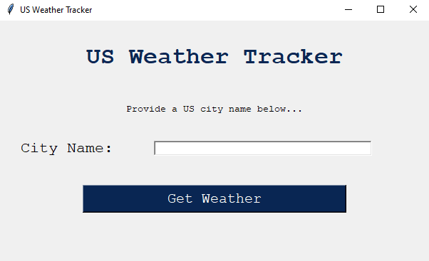
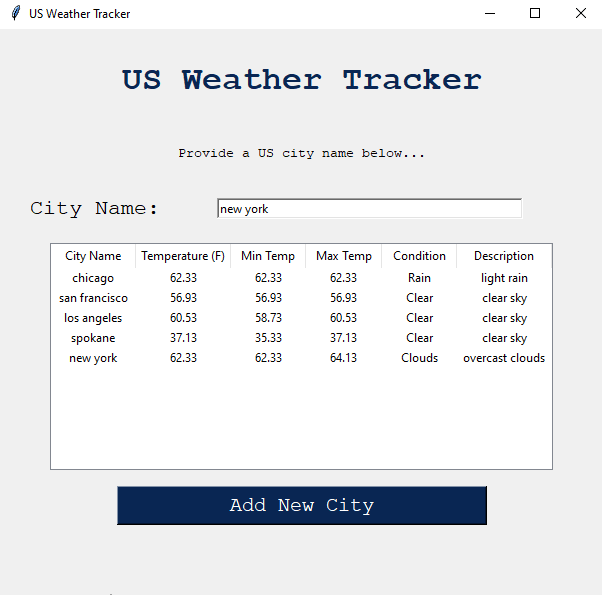

# Tkinter Python GUI Example - US City Weather Forecaster

Tkinter is a Python module used to create cross-platform GUIs.  USWeatherForecast.py demonstrates an example of a Tkinter application.

## How it works:
1. Run the script `USWeatherForecast.py` by typing either:
    ```bash
    python3 USWeatherForecast.py
    ```
    or
    ```bash
    python USWeatherForecast.py
    ```
2. A window will pop up that looks like the following screen:



From this screen, enter in a US city name and click the "Get Weather" button.

3. The interface should update to display a table with the city's weather information.



4. To add another city, enter a new city in the text box and click the "Add New City" button.


## API Information
The application displays the following information:

- The US city name entered by the user
- The current temperature in Fahrenheit
- The minimum daily temperature (Fahrenheit)
- The maximum daily temperature (Fahrenheit)
- The current weather condition
- A brief description of the type of weather condition (more detail)

All of the above information is from the free, open-source [Open Weather Map RapidAPI](https://rapidapi.com/community/api/open-weather-map/)

## Author(s)

Megan Dolan @mgndolan
