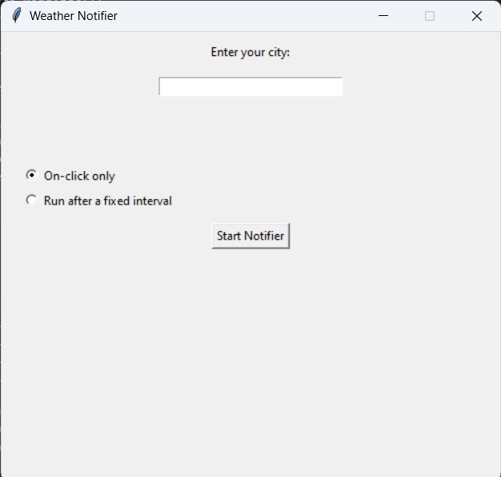
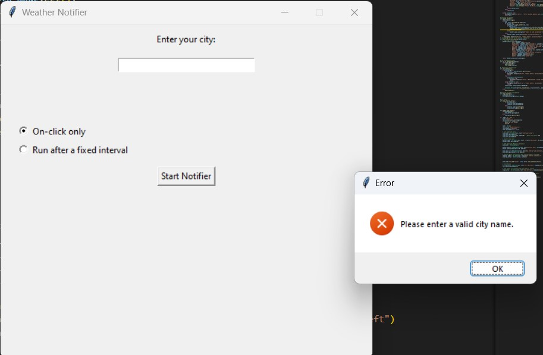
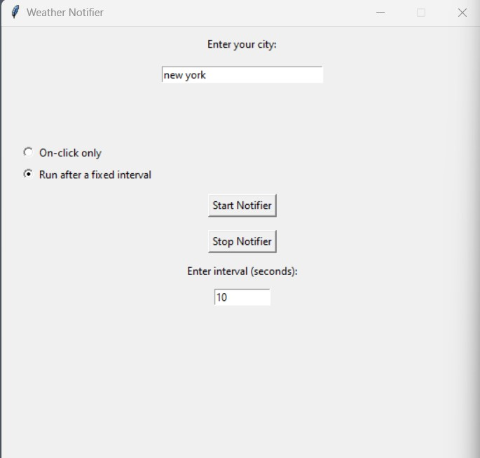
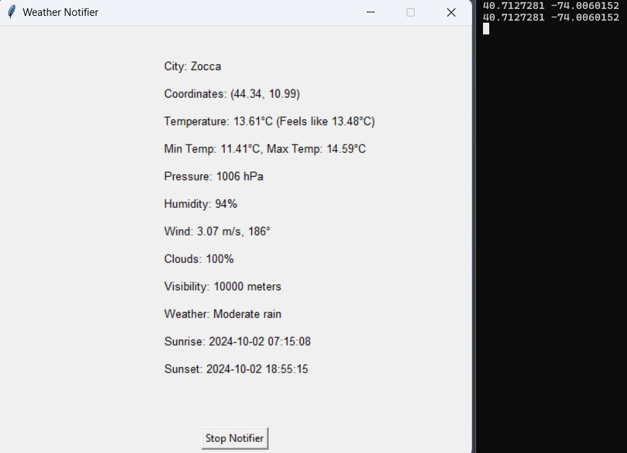

# Weather Notifier - README

## Overview
The **Weather Notifier** is a Python-based GUI application built with `Tkinter`, which allows users to retrieve weather information for any city using the OpenWeatherMap API. It provides two modes of operation:
- **Manual Mode**: Fetch the weather on-demand with a single click.
- **Auto Mode**: Fetch the weather at regular intervals and can also run in background.

The app displays current weather details such as temperature, humidity, wind speed, and more in a user-friendly interface.

## Features
- Fetch current weather for any city globally.
- Switch between manual and automatic weather updates.
- Display detailed weather information, including temperature, humidity, wind, and more.
- Adjustable update interval when in auto mode.
- Option to stop the automatic weather updates and return to the main city selection screen.

## Prerequisites
1. Python 3.x
2. The following Python libraries:
   - `Tkinter`
   - `requests`
   - `threading`
   - `geopy`
   - `dotenv`

To install the required libraries, use the following command:
```bash or windows 
pip install -r requirements.txt
```

## Installation and Setup
1. Clone the repository or download the script.
2. Set up a `.env` file in the same directory as the script, and add your OpenWeatherMap API key like so:
    ```env
    OPENWEATHER_API_KEY=your_api_key_here
    ```
3. Run the script:
   ```bash
   python weather_notifier.py  
   ``` 

## Usage
1. **City Entry**: 
   - Enter the name of the city for which you want to fetch the weather.

2. **Mode Selection**: 
   - **Manual Mode**: Select "On-click only" to get weather updates with a button press.
   - **Auto Mode**: Select "Run after a fixed interval" and input an interval in seconds to get weather updates automatically at the specified interval.

3. **Start Notifier**:
   - Click the `Start Notifier` button to begin fetching weather updates.

4. **Stop Notifier**:
   - If you are in auto mode, click the `Stop Notifier` button to stop automatic updates and return to the city selection screen.

## Example
- In manual mode, you simply input your city name and press the `Start Notifier` button to get weather information.
- In auto mode, you can set an interval (e.g., 10 seconds) to fetch updates regularly, which will continue until the `Stop Notifier` button is pressed.

## Notes
- Ensure you have a valid OpenWeatherMap API key in your `.env` file.
- The app defaults to "On-click only" mode if no mode is selected.

## Screenshots





