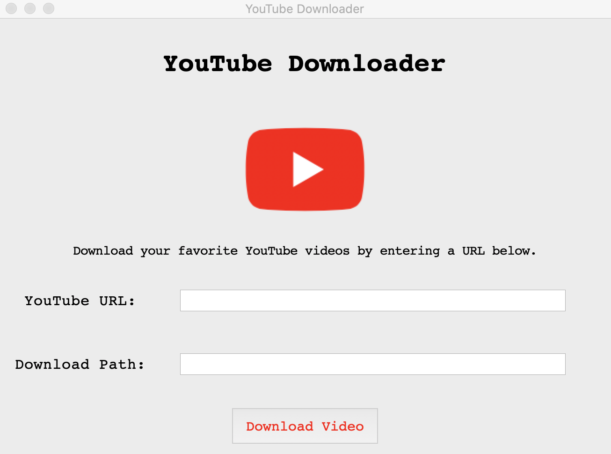
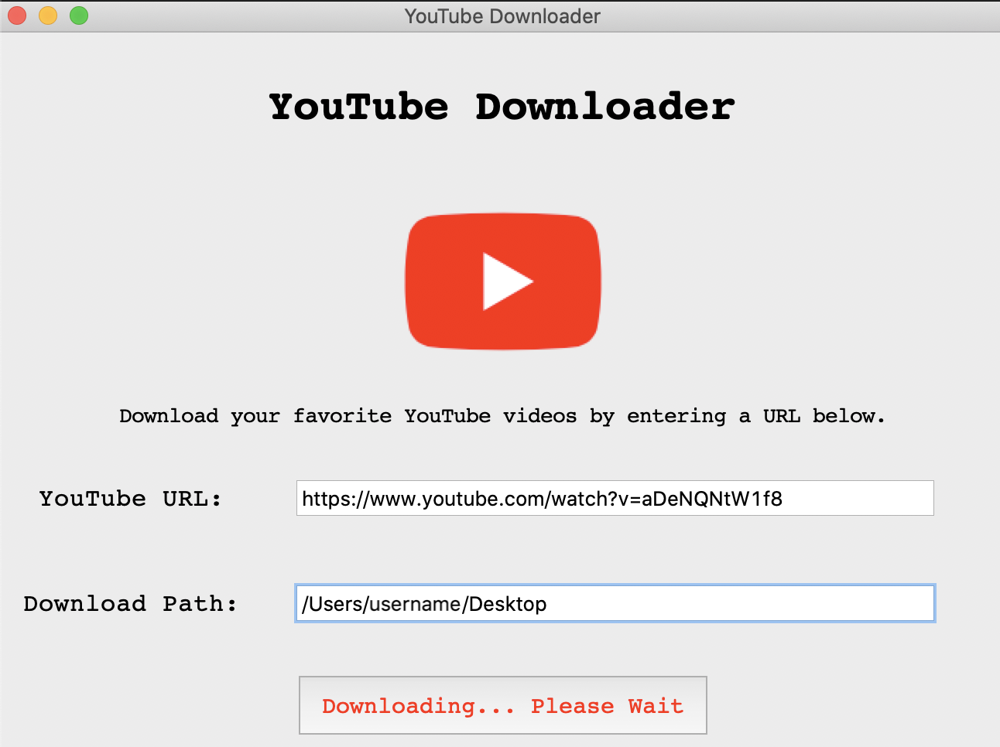

# Youtube Downloader Python3 GUI

This application displays a pop-up GUI for the Youtube Downloader tool using Tkinter. Tkinter is a Python module used to create cross-platform GUIs. This application can download YouTube videos in different resolutions, with captions (if available). For more information about the Youtube Downloader tool itself, see the README.md file in the youtube_downloader folder.

## Setup

For Unix based systems please execute the following command to create venv and install requirements :

```bash
make init
source .venv/bin/activate
```

Install all of the necessary dependencies, such as:
```
pip install pytube
```

## How it works:
1. Run the script `YoutubeDL.py` by typing either:
    ```bash
    python3 YoutubeDL.py
    ```
    or
    ```bash
    python YoutubeDL.py
    ```
2. A window will pop up that looks like the following screen:



Enter in the URL of a YouTube video, as well as the local path to wherever you would like
the video saved to. The directory path is an optional field, although it will download the
video to the current directory if no other path is specified.

3. Click on the "Download Video" button. The video may take awhile to download. The button will
update status to display "Downloading... Please Wait" while `ytdownloader.py` is executing (see image
below). Once the video is finished downloading, the button text will return to normal.




4. To download another video, type in another URL and repeat the process.

## Author(s)

Megan Dolan @mgndolan
(GUI for work done on youtube_downloader)
